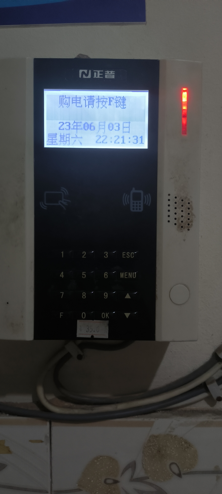
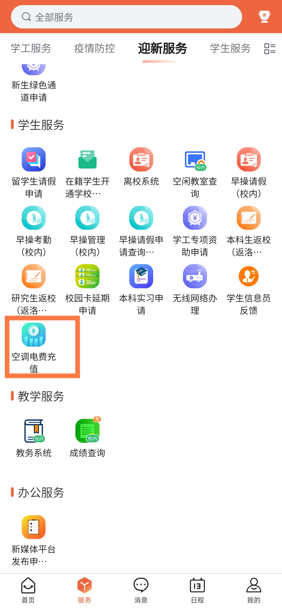
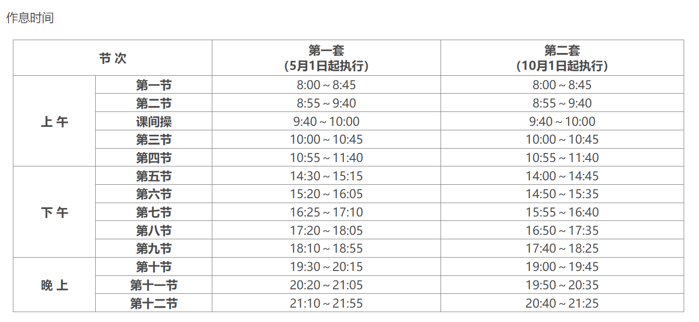

# 河南科技大学生存指北

## 报道篇

报道地址为：

开元校区：洛阳市洛龙区开元大道263号河南科技大学开元校区北门
西苑校区：洛阳市涧西区西苑路48号河南科技大学西苑校区南院

新生报到期间，学校在洛阳火车站、洛阳龙门高铁站设立“迎新接待站”迎接新生， 新生可凭《录取通知书》按报到校区有序乘坐迎新车辆分别至开元校区或西苑校区。

开元校区的同学们进校后将由志愿者引导乘坐校内免费摆渡车到达各学院、书院报到点，完成报到手续办理。　　

西苑校区的同学们下车后由各学院志愿者引导至各学院报到点，完成报到手续办理。

到达宿舍附近后会看到各个学院的迎新帐篷，在帐篷处凭录取通知书等证件领取校园一卡通并上交录取通知书，录取通知书收缴后外壳会陆续下发留作纪念。__有些学院会有迎新活动，不要忘了参与。__

前往宿舍时可以找志愿者帮忙搬运行李，到达宿舍后找宿管阿姨签字并领取钥匙，阿姨会拉你进宿舍楼群。

所有宿舍均有空调，可按需缴纳空调押金并进行电费充值。

空调遥控器可到指定区域领取，手机若具有红外功能也可用手机开启空调。

报道流程到这里就结束了，可以收拾一下寝室逛逛学校。

## 先导篇

### 学校官方网站

[河南科技大学](https://www.haust.edu.cn/)
学校的各种通知会发布在上面

[河南科技大学教务处](https://jwc.haust.edu.cn/)
一部分通知会发布在教务处

[河南科技大学教务管理系统](https://jwgl.haust.edu.cn/)
选课及查看考试时间等

[网络信息与现代教育技术中心](https://metic.haust.edu.cn/)
一卡通、校园网、教育邮箱等使用方法

[河南科技大学体育学院](https://ty.haust.edu.cn/)
查询当年体测成绩

各学院官网请自行查找

__强烈建议使用RSS订阅学校官网、教务处及本学院通知__

### 校园一卡通

校园一卡通为全校师生提供校园餐饮、洗浴的消费和充值等服务。

一卡通充值

充值方式：

1.我i科大app校园支付功能用微信或支付宝充值。

2.我i科大电脑端服务中心在线缴费功能微信或支付宝充值。

3.[校园支付平台](https://pay.haust.edu.cn)在线缴费功能微信或支付宝充值。

4.在圈存机上签约圈存（从绑定的银行卡上扣款充值）。
学生一卡通补办

__在我i科大app充值之后要去餐厅刷卡或在圈存机领取款项之后充值的钱才能在餐厅之外消费！！！！__

__在我i科大app充值之后要去餐厅刷卡或在圈存机领取款项之后充值的钱才能在餐厅之外消费！！！！__

__在我i科大app充值之后要去餐厅刷卡或在圈存机领取款项之后充值的钱才能在餐厅之外消费！！！！__

补办流程：首先挂上卡（圈存机上挂失），然后在“我i科大”-“校园支付”功能缴费，最后到自助补卡机取卡,也可直接去自助补卡机补卡。

补办方法

1.自助补卡机补办

先自助挂失校园卡——我i科大“校园支付”交补卡费 ——自助补卡机上补办。

自助补卡机位置：

开元校区图书馆二楼网络信息中心服务大厅

嘉园餐厅一楼自助服务大厅

西苑校区四号楼一楼自助服务大厅

2.人工补办

先自助挂失校园卡——我i科大“校园支付”交补卡费——网络信息中心服务大厅补办。

人工补卡位置：

开元校区图书馆二楼

西苑校区四号楼侧一楼

### 校园网

#### 有线网

寝室有线网免费使用，用网线将电脑和宿舍有线网端口连接起来后使用[上网认证客户端（宿舍）](https://metic.haust.edu.cn/info/1010/1677.htm)即可登录使用，登录账号为学号，初始密码为身份证后6位。

#### 无线网

开学期间会有各种人员推销校园卡（电话卡），校园卡送校园网（本段中特指无线校园网）无需单独购买。

单独购买校园网请前往开元校区图书馆二楼网络信息中心服务大厅（开元校区）、（西苑校区）按照相应流程缴费购买。

#### VPN

校外使用学校内网服务需使用VPN服务，使用方法见[VPN服务指南](https://metic.haust.edu.cn/info/1010/1591.htm)

## 生活篇

### 寝室篇

#### 寝室条件

每层有公共厕所和丢垃圾的灰道，__不要把垃圾丢在外面的地上！！！__

嘉园有四人间和六人间，四人间上床下桌+独卫，六人间上床下桌独卫二选一，具体见下表（数据不全待补充）

| 嘉园   | 四人间 | 六人间 | 上床下桌 | 上下铺 | 独卫 |
| ------ | ------ | ------ | -------- | ------ | ---- |
| 1号楼  |        | ✓      | ✓        |        |      |
| 2号楼  |        | ✓      |          | ✓      | ✓    |
| 3号楼  | ✓      |        | ✓        |        | ✓    |
| 4号楼  | ✓      |        | ✓        |        | ✓    |
| 5号楼  |        | ✓      | ✓        |        |      |
| 6号楼  |        | ✓      |          | ✓      | ✓    |
| 7号楼  |        | ✓      |          | ✓      | ✓    |
| 8号楼  |        | ✓      |          | ✓      | ✓    |
| 9号楼  |        | ✓      |          | ✓      | ✓    |
| 10号楼 | ✓      |        | ✓        |        | ✓    |
| 11号楼 | ✓      |        | ✓        |        | ✓    |
| 12号楼 | ✓      |        | ✓        |        | ✓    |

| 菁园   | 四人间 | 六人间 | 上床下桌 | 上下铺 | 独卫 |
| ------ | ------ | ------ | -------- | ------ | ---- |
| 1号楼  |        | ✓      |          | ✓      | ✓    |
| 2号楼  |        | ✓      |          | ✓      | ✓    |
| 3号楼  | ✓      |        | ✓        |        | ✓    |
| 4号楼  |        | ✓      |          | ✓      | ✓    |
| 5号楼  |        | ✓      | ✓        |        |      |
| 6号楼  |        | ✓      |          | ✓      | ✓    |
| 7号楼  |        | ✓      |          | ✓      | ✓    |
| 8号楼  |        | ✓      |          | ✓      | ✓    |
| 9号楼  |        | ✓      |          | ✓      | ✓    |
| 10号楼 | ✓      |        | ✓        |        | ✓    |
| 11号楼 | ✓      |        | ✓        |        | ✓    |
| 12号楼 |        | ✓      | ✓        |        |      |
| 13号楼 |        | ✓      | ✓        |        |      |
| 14号楼 |        | ✓      | ✓        |        |      |

乾园均为六人间上下铺+独卫

#### 水电

寝室电费在寝室入口处这个机器使用校园一卡通刷卡充值，充值前请确保一卡通内余额充足且充值款项已领取。

__在我i科大app充值之后要去餐厅刷卡或在圈存机领取款项之后充值的钱才能在餐厅之外消费！！！！__

嘉园和菁园空调不与寝室电费共享额度，空调电费在 我i科大——学生服务——空调电费充值 中充值

空调插座无功率限制，其他插座最大功率为550W（存疑），电脑1000W可用，避免使用纯电阻电器。若被断电请立即关闭所有电源，找宿管或寝室值班人员解决。__尽量避免在开学期间被断电__，可能会被要求写检查。

喝水可以使用公共饮水机或购买桶装水

嘉园公共饮水机使用支付宝小程序“校源网”，第一次使用需扫描饮水机上二维码进行注册绑定，可以充值或直接使用支付宝付款。嘉园只有单数层有公共饮水机（强烈谴责）

桶装水购买请咨询送水工作人员（没打钱不贴二维码）

### 洗浴篇

开元校区有乾园、嘉园两个浴池，营业时间为10:00-21:00,浴池有插座可自带吹风机。

嘉园浴池柜子分有锁和无锁，有锁柜子需要在前台缴纳20元现金作为钥匙押金，无锁柜子可自带锁。

乾园澡堂冬季20:30无钥匙,夏季21:00无钥匙 但是还有半个小时可以洗澡。

洗澡需使用一卡通进行付费，__浴资在浴室入口处圈存机进行圈存，不可直接使用一卡余额__，乾园、嘉园浴池余额不通用。

洗澡时把一卡通放进机器卡槽内，手在机器前方感应区停留几秒即可出水，停水同理。__洗完澡不要忘记自己的一卡通__

### 饮食篇

开元校区共有乾元餐厅、嘉园餐厅、菁园餐厅 ~~（嘉园第二餐厅）~~ 共三个餐厅。

（等有缘人写）

## 学习篇

作息时间如下表

大一有早操或早自习和晚自习，早操6:30-6:40开始，7:10左右结束，正常为跑操,太极比赛期间为太极拳;晚自习时长为两小时,第一套作息时间为19:30-21:30,第二套作息时间为19:00-21:00。(仅供参考以各学院实际规定为准)

### 学分

#### 课程学分

我校采用平均学分绩点（GPA）评定学生学习质量，其计算方法为:

课程学分绩点=课程学分×课程绩点×课程权重系数；

平均学分绩点=∑课程学分绩点/∑课程学分。

课程绩点根据考核成绩折算，具体折算办法规定如下：
| 考核成绩       | 折 算 办 法 |          |          |          |          |
| -------------- | ----------- | -------- | -------- | -------- | -------- |
| 百分制         | ＜60        | 60～69   | 70～79   | 80～89   | 90～100  |
| 五级制         | 不及格      | 及格=65  | 中=75    | 良=85    | 优=95    |
| 对应的课程绩点 | 0.0         | 1.0～1.9 | 2.0～2.9 | 3.0～3.9 | 4.0～5.0 |
课程权重系数规定如下：
| 课程类别     | 必修课 | 选修课 |
| ------------ | ------ | ------ |
| 课程权重系数 | 1.2    | 1.0    |

#### 课外培养学分

本科生在校学习期间，除获得规定的课内学分外，还必须参加课外培养活动获得9个课外培养学分，方能毕业。

课外培养学分包括：新生入学教育（含安全教育）1学分、军事技能训练2学分、创新创业实践2学分和其它课外素质培养实践4学分。

具体标准见

[河南科技大学学生课外素质教育学分认定范围及标准](documents/河南科技大学学生课外素质教育学分认定范围及标准.doc)

[河南科技大学课外培养学分认定内容及标准](documents/河南科技大学课外培养学分认定内容及标准.docx)

### 公选课

#### 公选课类型及应修学分

创新创业类  2学分

艺术教育类  2学分

就业指导类  2学分

心理健康类  2学分

人文社科类4学分或自然科学类4学分或人文社科类2学分+自然科学类2学分

四年内修完十二学分即可

#### 选课规则

1.第一、二轮选课：前两轮均无课程容量及选课时间先后的限制，无需抢课。选课后依据选课结果进行筛选，筛出多余课程容量的学生。两次选课筛选时不分当轮选课时间先后，第一轮筛选后的选课数据在第二轮不会被筛选掉。第二轮选课应避免选择第一轮人数已选满的课程。

2.停开课：第二轮选课后，选课人数低于最低开课人数要求的课程(一般为15人)将被停开。因课程停开、重修时间冲突、跨校区等原因未选上课程的学生请在第三轮选课。

3.确认选课结果：第三轮选课开始后的选课结果为准确结果，请在第三轮选课开始后在“打印选课确认单”中确认选课结果。

4.公共体育课：因公共体育课的特殊性，体育(2)和体育(4)在第一、二轮选课时施行限制选课对象，并在第二轮时施行限制容量、先到先得的方式选课，重修体育课的学生请在第三轮选。

5.实验物理：需先在新教务综合管理系统中选择对应教学班，然后再按开课单位要求在相关系统中选择具体项目，两处都选上后方可参加正常教学活动；

6.形势与政策：因各年级的形势与政策课程每学期所上内容类似，为保证课程的连续性，原则上不得跨年级提前修读，另外由于我校四年制与五年制本科专业的培养方案不同，四年制和五年制专业的学生不要交叉选形势与政策。

7.引进在线公选课：课程信息及见教务处相关文件，其在教务综合管理系统中的教学班显示“全校引进在线公选课”，具体学习时间、学习方法及考试时间以下学期第二周在教育在线发布的相关通知为准。

因特殊原因突破限选学分上限的学生请向所在学院教务员申请修改学分上限。选课时请确保无遗漏或多选课程，非选课期间不再进行补、退等调课处理。学生在选课期间如遇问题请及时向本学院教务员反映，若问题仍不能解决请咨询教务科（电话：65626216）。

## 社团组织篇

笔者没参加社团,等一个大佬写
