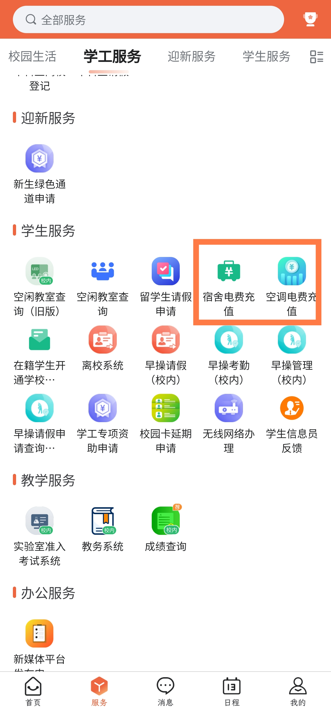
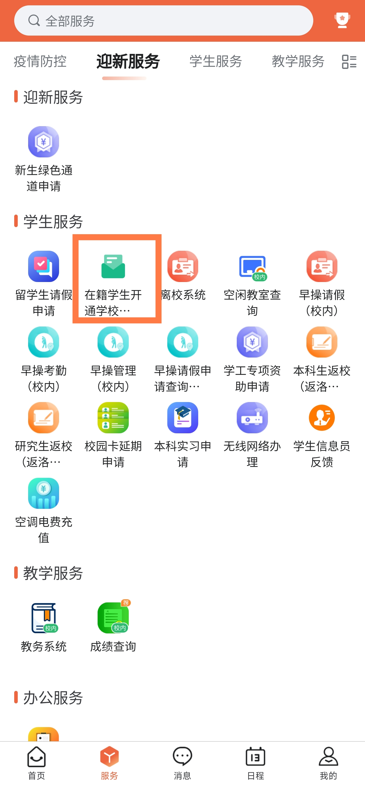

# 河南科技大学生存指北

## 报道篇

报道地址为：

开元校区：洛阳市洛龙区开元大道263号河南科技大学开元校区北门
西苑校区：洛阳市涧西区西苑路48号河南科技大学西苑校区南院

新生报到期间，学校在洛阳火车站、洛阳龙门高铁站设立“迎新接待站”迎接新生， 新生可凭《录取通知书》按报到校区有序乘坐迎新车辆分别至开元校区或西苑校区。

开元校区的同学们进校后将由志愿者引导乘坐校内免费摆渡车到达各学院、书院报到点，完成报到手续办理。　　

西苑校区的同学们下车后由各学院志愿者引导至各学院报到点，完成报到手续办理。

到达宿舍附近后会看到各个学院的迎新帐篷，在帐篷处凭录取通知书等证件领取校园一卡通并上交录取通知书，录取通知书收缴后外壳会陆续下发留作纪念。__有些学院会有迎新活动，不要忘了参与。__

前往宿舍时可以找志愿者帮忙搬运行李，到达宿舍后找宿管阿姨签字并领取钥匙，阿姨会拉你进宿舍楼群。

所有宿舍均有空调，可按需缴纳空调押金并进行电费充值。

空调遥控器可到指定区域领取，手机若具有红外功能也可用手机开启空调。

报道流程到这里就结束了，可以收拾一下寝室逛逛学校。

## 先导篇

### 学校官方网站

[河南科技大学](https://www.haust.edu.cn/)

[RSS](https://www.haust.edu.cn/system/resource/code/rss/rssfeed.jsp?type=list&treeid=1049&viewid=55526&mode=10&dbname=vsb&owner=1469948790&ownername=haust2018&contentid=60522&number=20&httproot=https%3A%2F%2Fwww.haust.edu.cn)

学校的各种通知会发布在上面

[河南科技大学教务处](https://jwc.haust.edu.cn/)

一部分通知会发布在教务处

[河南科技大学教务管理系统](https://jwgl.haust.edu.cn/)

选课及查看考试时间等

[网络信息与现代教育技术中心](https://metic.haust.edu.cn/)

一卡通、校园网、教育邮箱等使用方法

[河南科技大学体育学院](https://ty.haust.edu.cn/)
查询当年体测成绩

[各学院官网](https://www.haust.edu.cn/xxgk/xyxb.htm)

__强烈建议使用RSS订阅学校官网、教务处及本学院通知__

### 校园一卡通

校园一卡通为全校师生提供校园餐饮、洗浴的消费和充值等服务。

一卡通充值

充值方式：

1.我i科大app校园支付功能用微信或支付宝充值。

2.我i科大电脑端服务中心在线缴费功能微信或支付宝充值。

3.[校园支付平台](https://pay.haust.edu.cn)在线缴费功能微信或支付宝充值。

4.在圈存机上签约圈存(从绑定的银行卡上扣款充值)。
学生一卡通补办

__在我i科大app充值之后要去餐厅刷卡或在圈存机领取款项之后充值的钱才能在餐厅之外消费！！！！__

__在我i科大app充值之后要去餐厅刷卡或在圈存机领取款项之后充值的钱才能在餐厅之外消费！！！！__

__在我i科大app充值之后要去餐厅刷卡或在圈存机领取款项之后充值的钱才能在餐厅之外消费！！！！__

补办流程：首先挂失卡(圈存机上挂失)，然后在“我i科大”-“校园支付”功能缴费，最后到自助补卡机取卡，也可直接去自助补卡机补卡。

__如果校园一卡通丢失，请及时在圈存机上挂失！__

补办方法

1.自助补卡机补办

先自助挂失校园卡——我i科大“校园支付”交补卡费 ——自助补卡机上补办。

自助补卡机位置：

开元校区图书馆二楼网络信息中心服务大厅

嘉园餐厅一楼自助服务大厅

西苑校区四号楼一楼自助服务大厅

2.人工补办

先自助挂失校园卡——我i科大“校园支付”交补卡费——网络信息中心服务大厅补办。

人工补卡位置：

开元校区图书馆二楼

西苑校区四号楼侧一楼

### 校园网

#### 有线网

寝室有线网免费使用，用网线将电脑和宿舍有线网端口连接起来后使用[上网认证客户端(宿舍)](https://metic.haust.edu.cn/info/1010/1677.htm)即可登录使用，登录账号为学号，初始密码为身份证后6位。
嘉园和菁园由于是老园区，故宿舍内网口速率最高为100M。乾元为近几年新建的园区，网口速率可达1000M，下载学习资料或者游戏可以跑满上行与下行。

#### 无线网

开学期间会有各种人员推销校园卡(电话卡)，校园卡送校园网(本段中特指无线校园网)无需单独购买。
但是校园卡一般不推荐办理，一个月49的套餐只包校内200g，出了校园就用不了了，还不如直接去拼多多买个19元200g的。。

学校餐厅和学校的图书馆无线网也均免费，输入学号和密码选择校园网就可登录成功，其他地方需要购买校园网。

单独购买校园网请前往开元校区图书馆二楼网络信息中心服务大厅(开元校区)、西苑校区四号楼(西苑校区)按照相应流程缴费购买。或者登录我i科大APP-学生服务-无线网络办理进行线上办理。

#### VPN

校外使用学校内网服务需使用VPN服务，使用方法见[VPN服务指南](https://metic.haust.edu.cn/info/1010/1591.htm)

## 生活篇

### 寝室篇

#### 寝室条件

开元校区:

嘉园有四人间和六人间，四人间上床下桌+独卫，六人间上床下桌独卫二选一，具体见下表(仅供参考)

| 嘉园   | 四人间 | 六人间 | 上床下桌 | 上下铺 | 独卫 |
| ------ | ------ | ------ | -------- | ------ | ---- |
| 1号楼  |        | ✓      | ✓        |        |      |
| 2号楼  |        | ✓      |          | ✓      | ✓    |
| 3号楼  | ✓      |        | ✓        |        | ✓    |
| 4号楼  | ✓      |        | ✓        |        | ✓    |
| 5号楼  |        | ✓      | ✓        |        |      |
| 6号楼  |        | ✓      |          | ✓      | ✓    |
| 7号楼  |        | ✓      |          | ✓      | ✓    |
| 8号楼  |        | ✓      |          | ✓      | ✓    |
| 9号楼  |        | ✓      |          | ✓      | ✓    |
| 10号楼 | ✓      |        | ✓        |        | ✓    |
| 11号楼 | ✓      |        | ✓        |        | ✓    |
| 12号楼 | ✓      |        | ✓        |        | ✓    |

| 菁园   | 四人间 | 六人间 | 上床下桌 | 上下铺 | 独卫 |
| ------ | ------ | ------ | -------- | ------ | ---- |
| 1号楼  |        | ✓      |          | ✓      | ✓    |
| 2号楼  |        | ✓      |          | ✓      | ✓    |
| 3号楼  | ✓      |        | ✓        |        | ✓    |
| 4号楼  |        | ✓      |          | ✓      | ✓    |
| 5号楼  |        | ✓      | ✓        |        |      |
| 6号楼  |        | ✓      |          | ✓      | ✓    |
| 7号楼  |        | ✓      |          | ✓      | ✓    |
| 8号楼  |        | ✓      |          | ✓      | ✓    |
| 9号楼  |        | ✓      |          | ✓      | ✓    |
| 10号楼 | ✓      |        | ✓        |        | ✓    |
| 11号楼 | ✓      |        | ✓        |        | ✓    |
| 12号楼 |        | ✓      | ✓        |        |      |
| 13号楼 |        | ✓      | ✓        |        |      |
| 14号楼 |        | ✓      | ✓        |        |      |

乾园均为六人间上下铺+独卫

西苑校区:

- 北苑：十号楼，十一号楼均为八人间上下铺，带有阳台和独卫，部分宿舍四人间上下铺带有阳台独卫（很少），另外十一号楼有研究生宿舍四人间上床下桌带阳台独卫。

- 南苑：一般为六人间-八人间，根据宿舍楼不同分有阳台独卫

#### 水电

嘉园 菁园电费在寝室入口处下图所示机器使用校园一卡通刷卡充值，充值前请确保一卡通内余额充足且充值款项已领取。
乾园 西苑在 我i科大——学生服务——寝室电费充值 中充值

__在我i科大app充值之后要去餐厅刷卡或在圈存机领取款项之后充值的钱才能在餐厅之外消费！！！！__

嘉园 菁园 西苑空调不与寝室电费共享额度，请在 我i科大——学生服务——空调电费充值 中缴纳空调电费

空调插座无功率限制，其他插座最大功率为550W(存疑)，电脑1000W可用，学校采用的是相位检测的方法检测纯电阻电路并进行断电限制，所以要避免使用纯电阻电器，如果你有能力，可以并上一个超级大电容（非极性）。若被断电请立即关闭所有电源，找宿管或寝室值班人员解决。__尽量避免在开学期间被断电__，可能会被要求写检查。

喝水可以使用公共饮水机或购买桶装水

嘉园公共饮水机使用支付宝小程序“校源网”，第一次使用需扫描饮水机上二维码进行注册绑定，可以充值或直接使用支付宝付款。 ~~嘉园只有单数层有公共饮水机(强烈谴责)~~ 现在双数层也有了

桶装水购买请咨询送水工作人员(没打钱不贴二维码)

全校禁止使用吸顶灯，哪怕功率再小都不行，被宿管发现则立即断电。（原因是后勤管理公司觉得充电功率只有5v1a的吸顶灯太危险了）

### 自动售货机篇

乾园所有楼均有自动售货机，但只分布在1层和5层

### 洗浴篇

开元校区有乾园、嘉园两个浴池，有营业时间为10：00-21：00，浴池有插座可自带吹风机。

菁园每个宿舍楼一楼也浴室，使用大白U帮app进行充值、预约(菁城赢太多了)

嘉园浴池柜子分有锁和无锁，有锁柜子需要在前台缴纳20元现金作为钥匙押金，无锁柜子可自带锁。

乾园澡堂冬季20：30无钥匙，夏季21：00无钥匙 但是还有半个小时可以洗澡。

洗澡需使用一卡通进行付费，__浴资在浴室入口处圈存机进行圈存，不可直接使用一卡余额__，乾园、嘉园浴池余额不通用。

洗澡时把一卡通放进机器卡槽内，手在机器前方感应区停留几秒即可出水，停水同理。

__洗完澡不要忘记自己的一卡通__

### 医疗篇

医院分布在两个校区地址、电话如下：

开元校区：开元校区鲲鹏路西段学校体育馆南侧 电话：64231849

西苑校区卫生所：青滇路南端  电话：64231849

1. 当您患病时，请先到校医院就医。校医院为您提供安全可靠、热情周到的医疗服务(校医院的所有药品和医疗用品均通过招标从正规厂家购进)。不可随便到私人诊所就医，因为有可能对您的康复造成不必要的麻烦和伤害。

2. 当您患疾病需要住院时，请出示您的有效身份证件，在校医院住院部办理住院手续。如需转院，由校医院主治医师开具转诊证明并加盖校医院公章，转入上一级医院治疗。

3. 学生入校已办理城镇居民基本医疗保险，学生原则上应先到校医院就诊(急诊除外)，确需转诊时，须经校医院开具转诊证明后到指定医院就诊。

[河南科技大学大学生普通门诊医疗费报销办法](documents/河南科技大学大学生普通门诊医疗费报销办法.pdf)

[洛龙区大学生城乡居民参保登记流程](documents/洛龙区大学生城乡居民参保登记流程.pdf)(仅供参考，具体情况请咨询校医院或辅导员)

### 快递篇

#### 快递站点分布情况

以下内容来自科大快递综合服务中心微信公众

河科大快递是按快递公司分的，而不是按地址分，具体分部情况如下：

开元校区：

1. 嘉园：极兔(全科大)

2. 菁园6：申通(地址菁园嘉园科大)

3. 菁十一：京东(地址只有科大和地址菁园)顺丰(地址菁园)

4. 乾园商业街：圆通、中通、韵达、丹鸟、邮政、京东(地址嘉园乾园)、顺丰(地址科大，嘉园，菁园)

5. 乾园小木屋：申通(地址科大嘉园乾园)

西苑校区：

1. 南苑篮球场旁边菜鸟驿站
2. 南苑体育馆旁边菜鸟驿站（一般为极兔和ems）
3. 22号街坊驿站，这个离北苑的同学比较近，在小吃街里面，推荐

### 饮食篇

#### 餐厅付款方式

餐厅就餐使用一卡通或二维码付款

1. 一卡通付款
一卡通充值：我i科大——金融服务——校园卡充值

2. 二维码付款
   - 我i科大虚拟卡：我i科大——金融服务——虚拟卡 __虚拟卡付款和实体卡一样需要预先充值__
   - 支付宝、微信付款码：这种方无需提前充值，直接使用支付宝、微信余额或银行卡进行消费，但需要绑定完美校园。

    完美校园绑定方法：支付宝、微信搜索“完美校园”小程序或下载“完美校园”APP按提示完成绑定。APP绑定位置为 我的——设置——账号与安全
开元校区共有乾元餐厅、嘉园餐厅、菁园餐厅 ~~(嘉园第二餐厅)~~ 共三个餐厅。

### 失物招领处

| 宿舍区 | 地址                          | 运营时间              |
| ------ | ----------------------------- | --------------------- |
| 嘉园   | 嘉园10号楼二楼"学区之家"      | 周一至周五 8:00-18:00 |
| 菁园   | 农科①号楼116                  | 周一至周日 8:00-18:00 |
| 乾园   | 乾园8号楼一楼"一站式服务中心" | 周一至周日 7:00-22:00 |

## 学习篇

作息时间如下表，有课才上，没课不用上。

查询课表除使用我i科大外还可使用学习通、小爱课程表、超级课程表、WakeUp课程表等，推荐使用小爱课程表和WakeUp课程表

~~大一有早操或早自习和晚自习，早操6:30-6:40开始，7:10左右结束，正常为跑操，太极比赛期间为太极拳~~

学校已取消强制跑操,具体已各学院实际规定为准;

晚自习时长为两小时，第一套作息时间为19:30-21:30，第二套作息时间为19:00-21:00。(仅供参考以各学院实际规定为准)

### 学分

#### 课程学分

我校采用平均学分绩点(GPA)评定学生学习质量，其计算方法为：

课程学分绩点=课程学分×课程绩点×课程权重系数；

$\text{平均学分绩点}=\frac{\sum\text{课程学分绩点}}{\sum\text{课程学分}}$

课程绩点根据考核成绩折算，具体折算办法规定如下：
| 考核成绩       | 折 算 办 法 |          |          |          |          |
| -------------- | ----------- | -------- | -------- | -------- | -------- |
| 百分制         | ＜60        | 60～69   | 70～79   | 80～89   | 90～100  |
| 五级制         | 不及格      | 及格=65  | 中=75    | 良=85    | 优=95    |
| 对应的课程绩点 | 0.0         | 1.0～1.9 | 2.0～2.9 | 3.0～3.9 | 4.0～5.0 |

即60分绩点为1，60分后每多1分加0.1绩点

课程权重系数规定如下：
| 课程类别     | 必修课 | 选修课 |
| ------------ | ------ | ------ |
| 课程权重系数 | 1.2    | 1.0    |

#### 课外培养学分

本科生在校学习期间，除获得规定的课内学分外，还必须参加课外培养活动获得9个课外培养学分，方能毕业。

课外培养学分包括：新生入学教育(含安全教育)1学分、军事技能训练2学分、创新创业实践2学分和其它课外素质培养实践4学分。

具体标准见

[河南科技大学学生课外素质教育学分认定范围及标准](documents/河南科技大学学生课外素质教育学分认定范围及标准.pdf)

[河南科技大学课外培养学分认定内容及标准](documents/河南科技大学课外培养学分认定内容及标准.pdf)

### 公选课

软件学院、莫动理工学院、国际教育学院教务系统与其他学院不同，具体选课规则参见各学院通知

软件学院大一选课为体育课和公选课（推荐选线上课，好刷分），但公选课与其他学院不同，为软院单独的公选课。大三有专业方面的选修课

#### 公选课类型及应修学分

创新创业类  2学分

艺术教育类  2学分

就业指导类  2学分

心理健康类  2学分

人文社科类4学分或自然科学类4学分或人文社科类2学分+自然科学类2学分

四年内修完十二学分即可

#### 选课规则

大一上学期体育必修太极，__大一上学期体育选课只是选老师，一定要选择学校分配的老师避免造成无法登记成绩等问题__

以下为往年选课规则仅供参考,以[教务处](https://jwc.haust.edu.cn/)发布通知为准

1. 第一、二轮选课：前两轮均无课程容量及选课时间先后的限制，无需抢课。选课后依据选课结果进行筛选，筛出多余课程容量的学生。两次选课筛选时不分当轮选课时间先后，第一轮筛选后的选课数据在第二轮不会被筛选掉。第二轮选课应避免选择第一轮人数已选满的课程。

2. 停开课：第二轮选课后，选课人数低于最低开课人数要求的课程(一般为15人)将被停开。因课程停开、重修时间冲突、跨校区等原因未选上课程的学生请在第三轮选课。

3. 确认选课结果：第三轮选课开始后的选课结果为准确结果，请在第三轮选课开始后在“打印选课确认单”中确认选课结果。

4. 公共体育课：因公共体育课的特殊性，体育(2)和体育(4)在第一、二轮选课时施行限制选课对象，并在第二轮时施行限制容量、先到先得的方式选课，重修体育课的学生请在第三轮选。

5. 实验物理：需先在新教务综合管理系统中选择对应教学班，然后再按开课单位要求在相关系统中选择具体项目，两处都选上后方可参加正常教学活动；

6. 形势与政策：因各年级的形势与政策课程每学期所上内容类似，为保证课程的连续性，原则上不得跨年级提前修读，另外由于我校四年制与五年制本科专业的培养方案不同，四年制和五年制专业的学生不要交叉选形势与政策。

7. 引进在线公选课：课程信息及见教务处相关文件，其在教务综合管理系统中的教学班显示“全校引进在线公选课”，具体学习时间、学习方法及考试时间以下学期第二周在教育在线发布的相关通知为准。

因特殊原因突破限选学分上限的学生请向所在学院教务员申请修改学分上限。选课时请确保无遗漏或多选课程，非选课期间不再进行补、退等调课处理。学生在选课期间如遇问题请及时向本学院教务员反映，若问题仍不能解决请咨询教务科(电话：65626216)。

### 体育课

体育课一般都很好过,每节课去上课就行了。有些课程考试难度较高，即使是同一门课程不同老师上课要求也可能不同，建议选课之前多方咨询。

[河南科技大学体育课程通则](documents/河南科技大学体育课程通则.pdf)(仅供参考)

## 社团组织篇

开学后大概九月底会举行一次百团大绽，届时将有百余个社团在菁园进行招新，有兴趣的可以提前前行了解，具体则等学校调整。

[社团目录](documents/河南科技大学社团(截止2022年11月).pdf)

## 杂项

### 申请学校邮箱

  首先在“我i科大-学生服务-在籍学生开通学校邮箱申请流程”提交申请，申请通过后在<https://mail.haust.edu.cn/> 选择“忘记密码”设置密码 [电子邮件用户帮助文档](https://metic.haust.edu.cn/info/1031/1614.htm)
  
  

### 公共交通

#### 公交

公交可以刷卡或者刷二维码，支付宝、云闪付首页点出行就会根据定位自动切换到洛阳公交卡，开通即可使用。
如果手机或手表有NFC功能可以开一张任意地区的交通联合电子交通卡，乘车时打卡NFC刷卡即可。洛阳公交卡不好看，笔者觉得没有办实体卡的必要
  
#### 地铁

地铁下载“洛易行”APP按照指引绑定，可以刷二维码或者刷脸，地铁也可以刷上面提到的交通联合电子交通卡
微信或者支付宝打开乘车码也可以

### 运动世界校园(校园跑)

  __校园跑不加学分！！！__

体育课成绩校园跑占12分，具体加分规则请咨询体育老师，~~实际不跑也能及格~~2024年第二学期规定为校园跑90次以下体育不及格,该规定是否持续尚不明确

校园跑最多可以给体测加5分，具体规则如下：为鼓励学生跑步的积极性，对跑步次数较多的学生给予《国家学生体质健康标准》加分奖励，具体加分标准是：一个年度累计次数100-120加1分；121-140加2分；141-160加3分；161-180加4分；181次及以上者加5分。注：大一新生(只有一个学期)按此规定减半执行，即第一学期累计次数50-60加1分；61-70加2分；71-80加3分；81-90加4分；91次及以上者加5分。

### 校园卡

校园卡就是一张手机卡，作用和你正在使用的电话卡一模一样只是校内流量较多，校园wifi和各类app是校园卡赠送服务。

__不办理校园卡不会影响正常学习和生活，考试、选课等均和校园卡无关！！！__

选课等要使用学校内网使用学校[VPN](#vpn)即可,所有考试均不需要使用校园网
__如果遭遇代班、代团或其他人员强制或变相强制办理校园卡请向学校举报__

### 电子版书籍

部分同学有使用电子版书籍的需要，这里列举几种寻找电子版书籍的方法

- 搜索引擎、知乎、b站等平台  使用较广泛的书籍一般都能找到
- [学校购买数据库](https://lib2.haust.edu.cn/libweb/digitalDatabase)
- Z-library,annas-archive(安娜的档案)，Library Genesis 请自行寻找镜像站点
- [找书网](https://findbooks.eu.org/) [findbooks](www.findbooks.info)
- [文献互助小帮手](https://greasyfork.org/zh-CN/scripts/435569-%E6%96%87%E7%8C%AE%E4%BA%92%E5%8A%A9%E5%B0%8F%E5%B8%AE%E6%89%8B-%E8%AF%BB%E7%A7%80pdf%E4%B8%80%E9%94%AE%E4%B8%8B%E8%BD%BD-%E5%9B%BE%E4%B9%A6%E9%A6%86%E8%81%94%E7%9B%9F-%E8%AF%BB%E7%A7%80-%E8%B6%85%E6%98%9F-%E4%B8%AD%E7%BE%8E%E7%99%BE%E4%B8%87%E6%98%BE%E7%A4%BAssid%E7%AD%89%E7%B4%A2%E4%B9%A6%E5%8F%B7-%E5%90%84%E6%96%87%E7%8C%AE%E7%AB%99-%E5%9B%BE%E4%B9%A6%E7%94%B5%E5%95%86%E7%AB%99%E4%B8%8E%E8%B1%86%E7%93%A3%E7%9A%84%E4%BA%92%E8%AE%BF%E9%93%BE%E6%8E%A5-%E4%B8%80%E9%94%AE%E5%A4%8D%E5%88%B6%E5%85%83%E6%95%B0%E6%8D%AE) (本校已购买读秀数据库)

### 志愿时长

毕业没有志愿时长要求，80小时志愿时长这一说法的来源笔者推断如下:其它课外素质培养实践学分中每20小时志愿时长认定0.5学分，志愿时长认定上限为两学分即80小时志愿时长。该学分可由多种途径获得,是否参见志愿活动取决于自身意愿。

### 太极拳比赛

太极拳比赛是河南科技大学多年以来的传统，能充分展现我科学子的优良作风。太极拳比赛需要坚定的毅力、不懈的努力，不惧早寒夜冷，不怕朝学暮练，请参加者谨慎报名，不要半途而废。参加该比赛该的福利不再赘述，但也请同学们摆正心态，不要为了好处而参赛，要为了锻炼自己，为了展现学院和班级的风采而参赛。

### 河南科技大学访客预约

- 预约流程:
  关注河南科技大学微信公众号,在底部选择"一 - 访客预约",阅读并同意"来访须知"后点击"立即预约"填写相关信息并上传访客照片(用于刷脸通行)即可成功预约

  如访客步行入校需拍照或上传人脸信息照片，用于门禁刷脸通行；如访客驾车入校需填写车牌号，用于机动车道闸识别。访问目的选择分为“公事”或者“私事”。如果访客有同行人的，需添加同行人的相关信息。

  访客可通过"访客预约"方式进入访客系统，查看审批结果。如有变化，访客可重新修改信息或取消预约。

- 注意事项:

  1. 选择“来访时间”和“离开时间”，仅限进校当天。

  2. “提交预约”前请再次核对填写信息，无误后点击“提交预约”。

  3. 预约成功后，车辆只能通过开元校区北门(开元大道263号)、西苑校区南院北门或北院南门进校；人员可通过开元校区北门、小北门和西门，西苑校区可通过南院北门和北院南门进校。

  4. 预约系统仅限各单位与校外单位的业务洽谈、学术交流、参观考察等活动使用。校内商户、后勤服务合作人员及车辆不能使用该预约系统。

  5. 校园安全管理需要全校各单位共同努力。按照“谁审批、谁负责”的原则，被访人应认真核实来访人员身份，并对来访人遵守学校相关规章制度尽到告知义务。凡通过审批入校的人员及车辆违反相关规定，产生的责任由审批单位负责。

  6. 各单位在使用访客系统过程中如有疑问，请致电咨询，电话:64231746、64231939。

---
如有任何问题请在issue留言，笔者将在15个工作日内回复(也可能不会)
交流群：824965867

LICENSE: [![CC BY-SA 4.0][cc-by-sa-shield]][cc-by-sa]

This work is licensed under a
[Creative Commons Attribution-ShareAlike 4.0 International License][cc-by-sa].

[![CC BY-SA 4.0][cc-by-sa-image]][cc-by-sa]

[cc-by-sa]: http://creativecommons.org/licenses/by-sa/4.0/
[cc-by-sa-image]: https://licensebuttons.net/l/by-sa/4.0/88x31.png
[cc-by-sa-shield]: https://img.shields.io/badge/License-CC%20BY--SA%204.0-lightgrey.svg
